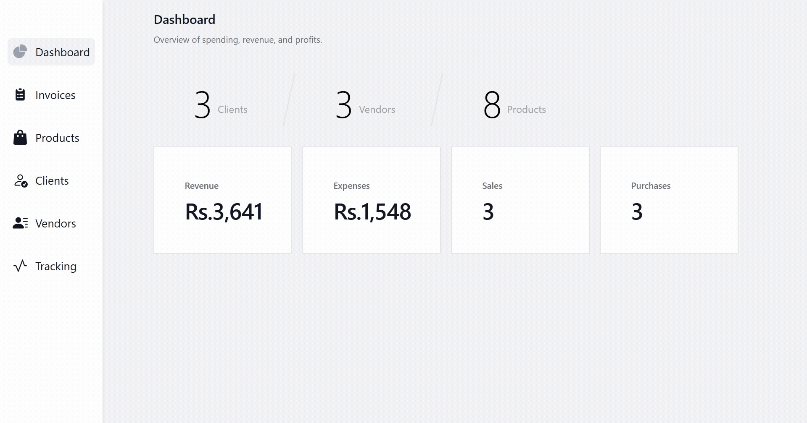

# 👋 I'm Najam us Saqib.

I'm a software engineer who loves to code and chat in a variety of programming and natural languages with friends from around the world. 🌏🌍🌎

I build cross-platform, full-stack Web apps using Javascript, TypeScript, Tailwindcss, SASS, Node.js, Nest.js, Express.js, Prisma ORM, PostgreSQL, Mongodb, Docker, AWS and many other technologies. 🧑‍💻

## Projects 🏗️

### [Portfolio Website](https://github.com/infosaqib/portfolio)

Modern portfolio website where I share my projects, skills, and experience. Made with Express.js, with smooth animations and interactive elements throughout. ✨

### [GMS](https://github.com/infosaqib/GMS-apk)

GMS App is a comprehensive Ginning Management System designed to streamline cotton ginning business operations. It provides a complete solution for managing products, clients, vendors, invoicing, and order tracking. ⚖️

## Languages and tools 🥇

